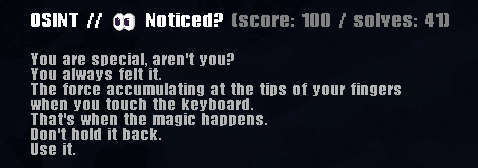

## Introduction
I solved the OSINT challange called "Noticed?" from CTF 1753CTF, more information about this CTF can be found [here](https://ctftime.org/event/2639/)



## Noticed?
I do not hide the fact that it was an interesting challenge. I had just some text and the flag had to be drawn from it.

Well, but this text was from the 1753ctf teaser I watched - so immediately after seeing this text I went to [youtube](https://www.youtube.com/watch?v=yRghHj9dkoo)

I was wondering what to do with this video. I watched it a dozen times, googled it on social media platforms, but still without a flag.

But after a while, I decided to watch it frame by frame, because maybe the flag is hidden somewhere on an individual frame.

I downloaded this video, used the ffmpeg option and extracted each frame:

```bash
ffmpeg -i ctf.mp4 frame_%00004d.jpg
```

After looking through each frame, I found the one with the flag on it, which is frame number 1444


 ```1753c{I_b3c4m3_a_h4ck3r}```
