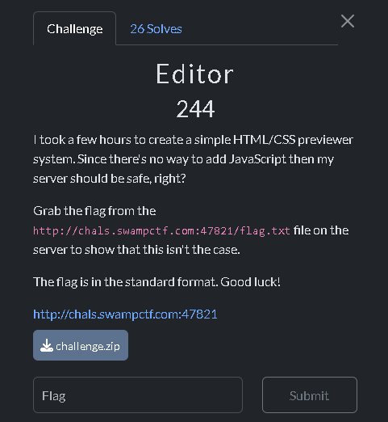
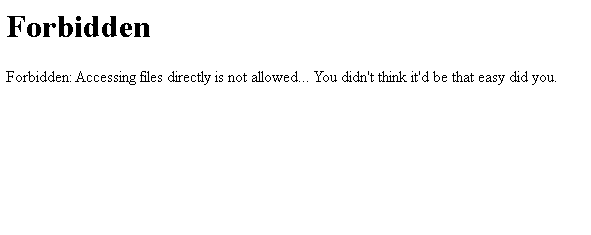
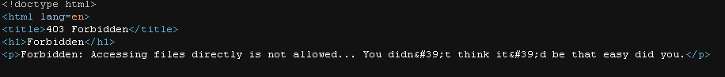
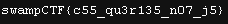

## Introduction
I solved the Editor challenge in the Web category. More info about this CTF is [here](https://ctftime.org/event/2573)



## Editor

I went to the page that was in the challange description, and I was prompted with the message "Forbidden"



I set up the server locally by downloading the attachment, then going into the backend and typing `python server.py`

I went to the site I put up locally (and again forbidden)


I checked the source code of this forbidden site



and I added the following code snippet to `<head>`

```css
<meta http-equiv="refresh" content="0;url=http://chals.swampctf.com:47821/flag.txt">
```

After this, flag popped up:



 ```swampCTF{c55_qu3r135_n07_j5}```

## Why it works?

- I uploaded the meta tag into the HTML:
  - The `<meta http-equiv="refresh" content="X;url=Y">` tells the browser to redirect the page.
  - The `content="0"` means redirect immediately (0 seconds delay).
  - The `url=http://chals.swampctf.com:47821/flag.txt` indicates the location of the redirection. In this case, it is also the place where the flag is stored.
- When the site renders HTML:
  - The browser thinks it is loading a normal page.
  - The meta refresh forces the browser to go to the flag file.
- Bypassing the Flask Server’s Restriction:
  - The Flask app checks the `Referer` header to block direct file access.
  - However, since the meta refresh comes from an allowed source (my local hosted site), the server treats it as a valid request.
  - The browser follows the redirect and displays the flag.