## Introduction
I have solved all 3 of the 3 OSINT tasks. More info about this CTF is [here](https://ctftime.org/event/2573)


## Party Time!
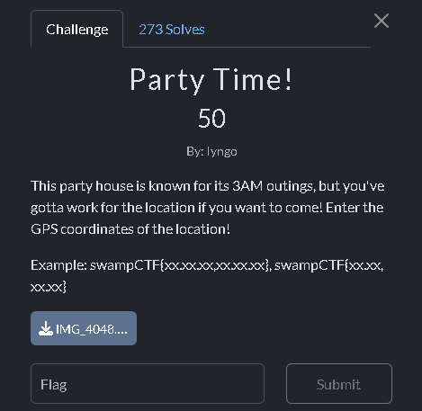
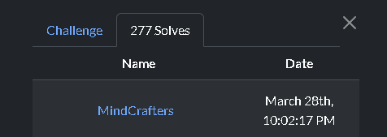

It was a simple challenge - and I've got first blood on it! The goal was to find a location from a photo. To solve this challange I simply extracted the metadata, and made it flag with it (the syntax was given to us in the challange description).

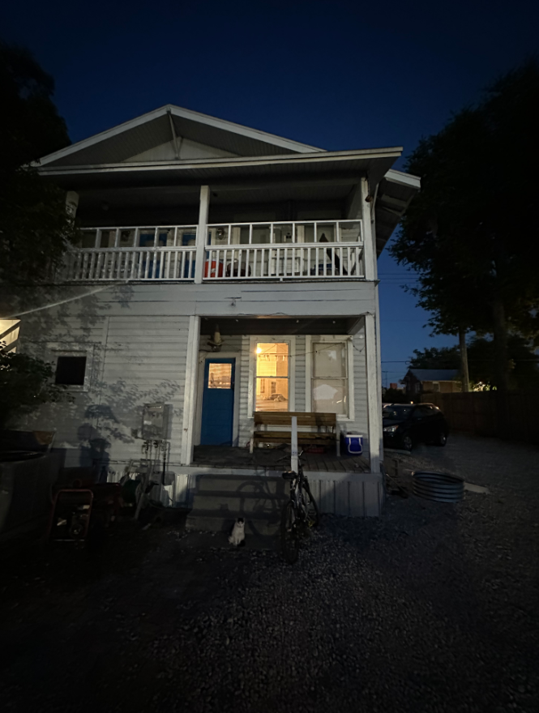

I used `exiftool` to check metadata in this photo:

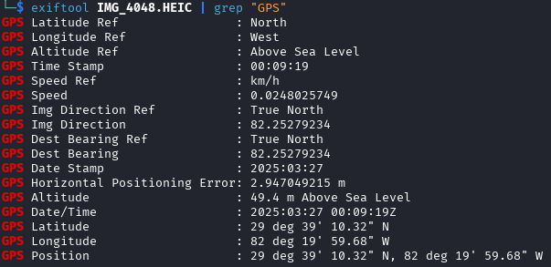

And after conversion from _degrees-minutes-seconds (DMS) notation_ to _decimal degrees (DD) notation_ I could use this data to form the flag.

```swampCTF{29.652867,82.333244}```

_The real coordinates were **29.652867 -82.333244**, but the flag format did not include a minus sign_

## Party Time! Level 2
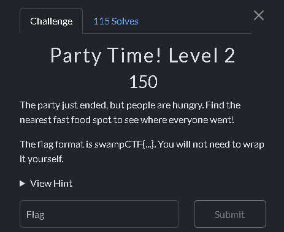

This was also a simple challenge, but I took the hint because I wanted to know exactly where to expect the flag. To do this challange I had to know where the location was from the first challange named _Party Time!_. The goal was to find a location of nearest fast food. To solve this challange I went on google maps and started looking around for the nearest fast food place, the moment I spotted several of them I used that hint I mentioned earlier - it also gave me valuable advice _"The reviews love the racecar fast service."_ , after looking at _Checkers_ fast food I went into the reviews and sorted them from the newest. Scrolling down a bit I noticed a flag

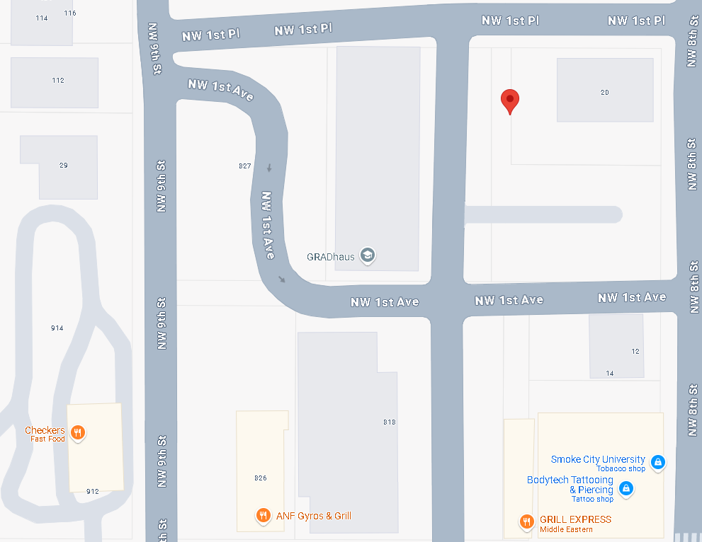

And when I went to _Checkers_ reviews:

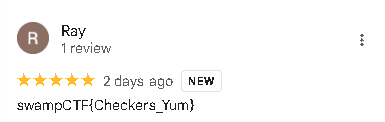

 ```swampCTF{Checkers_Yum}```

## On Thin Ice
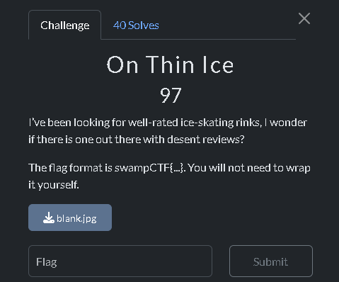

This challenge was a bit harder. The description told me to search for a well rated rink and in addition there was a downloadable attachment that included a dark photo.


I did `exiftool` on this photo and I noticed something interesting

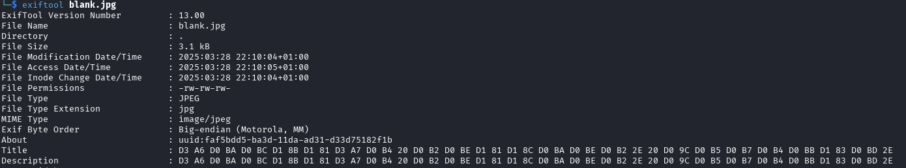

Description and title contain hexadecimal characters, I decoded them with Python

```py
import binascii
hex_string = "D3A6D0BAD0BCD18BD181D3A7D0B420D0B2D0BED181D18CD0BAD0BED0B22E20D09CD0B5D0B7D0B4D0BBD183D0BD2E"
decoded_text = bytes.fromhex(hex_string).decode("utf-8", errors="ignore")
print(decoded_text)
```

The output was: `Ӧкмысӧд воськов. Мездлун.`

I used Google Translator to translate it into English, the translated text is "Step eight. Freedom."
After quick google, I found out that this is a mission from `Call of Duty: Black Ops`

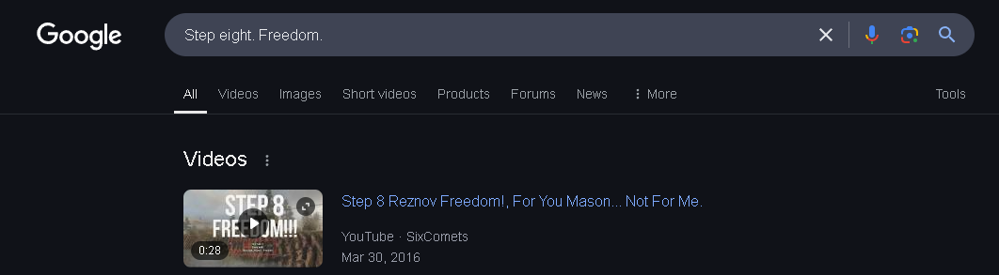

After scrolling down a bit, I also noticed the location of this mission

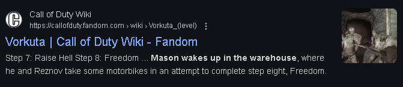

After going to Google Maps and typing "Vorkuta ice rink" in the search bar I found an ice rink, when I looked at reviews, I found the flag as the account name.

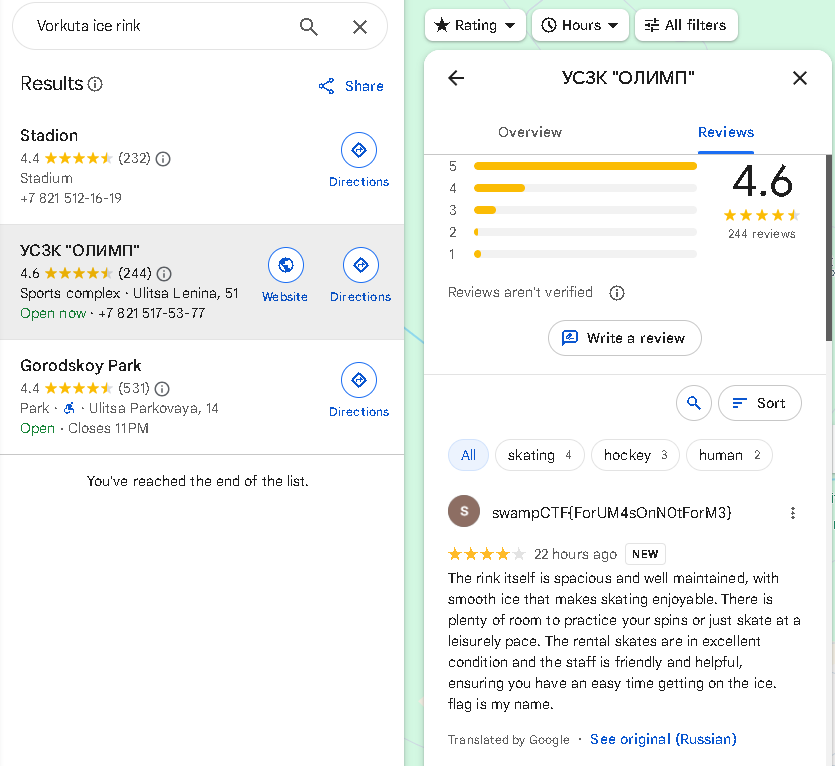

 ```swampCTF{ForUM4sOnN0tForM3}```
