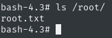

Room link: https://tryhackme.com/r/room/cyborgt8

We have these questions to answer:
- Scan the machine, how many ports are open?
- What service is running on port 22?
- What service is running on port 80?
- What is the user.txt flag?
- What is the root.txt flag?

On port 22 is ssh by default, and on port 80 is http, but first let's check it with a nmap scan - btw, we will then be able to answer question number 1

```bash
nmap -oN nmap.txt -Pn -T4 -sC -sV -p- 10.10.127.219
```

I immediately received a warning `Warning: 10.10.127.219 giving up on port because retransmission cap hit (6).`

So unfortunately too many requests to the server, I reduced  `-T4` to `-T3` and I deleted `-p-` and let it go again

and in the background I ran gobuster

```bash
gobuster dir -o gobuster.txt -u 10.10.127.219 -w /usr/share/wordlists/seclists/Discovery/Web-Content/common.txt
```

It showed me quite interesting directories, such as `/admin` and `/etc`

```
===============================================================
Starting gobuster in directory enumeration mode
===============================================================
/.htpasswd            (Status: 403) [Size: 278]
/.htaccess            (Status: 403) [Size: 278]
/.hta                 (Status: 403) [Size: 278]
/admin                (Status: 301) [Size: 314] [--> http://10.10.127.219/admin/]
/etc                  (Status: 301) [Size: 312] [--> http://10.10.127.219/etc/]
/index.html           (Status: 200) [Size: 11321]
/server-status        (Status: 403) [Size: 278]
Progress: 4734 / 4735 (99.98%)
===============================================================
Finished
===============================================================
```

nmap was over at the time and this came out of its output:
```
PORT   STATE SERVICE VERSION
22/tcp open  ssh     OpenSSH 7.2p2 Ubuntu 4ubuntu2.10 (Ubuntu Linux; protocol 2.0)
80/tcp open  http    Apache httpd 2.4.18 ((Ubuntu))
```

So in answer to question 1, I entered that they're 2 ports open. Btw, it was also able to confirm what is on these ports

I went to `/etc` and found 2 files there:


of which `passwd` contains quite interesting things to me


I cracked this hash using John the ripper

```bash
john --wordlist=/usr/share/wordlists/rockyou.txt passwd
```

success


I went into the directory `/admin` after that, and I found "Admins" in the navbar


I found out that you need to find a backup named "music_archive", so I clicked right on "Archive" and then it showed me the **Download**  button which allowed me to download the `archive.tar` file.


So a quick unzip of this file flew in

```bash
tar -xf archive.tar
```

Going to `home/field/dev/final_archive` I noticed various other files, so I did `cat` to read `README` file.


Hm, let's check it out


It looks like some sort of backup program

I went into usage, and a bit later I googled `borg`'s github

I also downloaded it https://github.com/borgbackup/borg/releases

I listed this previously downloaded archive using borg

```
./borg list home/field/dev/final_archive
```

it asked me for a password, so I typed in the previously cracked `squidward`


Well, let's try to extract it

```bash
./borg extract home/field/dev/final_archive/::music_archive
```

Asked me again for the password, so I typed `squidward`.

home folder appeared, which contained the user data of user `alex`


I decided to check it out, but this time nothing interesting


I'm trying to keep going


well we have something, I will try to log into ssh with this


Success! additionally by executing `ls` I was able to trace the user flag


Doing `sudo -l` also managed to discover something that can help escalate privileges


I'll display for myself what's in that file


I'll also check the permissions right away


Well, unfortunately, this time it will not be possible to escalate this user simply by editing this script

But, it is worth noting that this script includes the `getopts` function which is a built-in function for parsing script arguments and options. Tbh, I hadn't heard of this function before, but it caught my attention.


I used this function, using `sudo /etc/mp3backups/backup.sh -c /bin/bash`


Well, and I got shell root. But unfortunately I wasn't getting the output of the commands I typed in


In that case, I tried privilege escalation via the SUID bit

so as root:
- I entered `/tmp`
- and I did `cp /bin/bash ./bash`
- I also added SUID bit `chmod +s bash`
- I typed `exit` and returned to the user shell


as a user I did:
- `cd /tmp`
- `ls -la`


I went to [gtfobins](https://gtfobins.github.io/gtfobins/bash/#suid) and I read information on escalating root privileges using the SUID bit

and I typed as `alex` the `./bash -p` command


We have root shell again. Let's see if we can see the output of the commands this time



Great, all that's left is `cat /root/root.txt`

